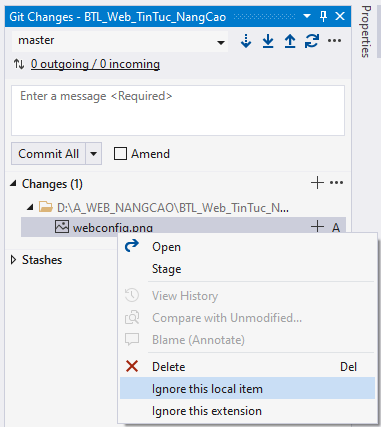

# Web_TinTuc_NangCao
Advanced Web Development Assignment

## Guide:
1. Clone this Repo by HTTPS
2. Add file Web.config to apply local config

3. Ignore this file on local to prevent push Web.config to remote, this file will be listed in .gitignore file

4. Web.config Example:

```
<?xml version="1.0" encoding="utf-8"?>
<!--
  For more information on how to configure your ASP.NET application, please visit
  https://go.microsoft.com/fwlink/?LinkId=169433
  -->
<configuration>
  <system.web>
    <compilation debug="true" targetFramework="4.7.2" />
    <httpRuntime targetFramework="4.7.2" />
  </system.web>
  <system.codedom>
    <compilers>
      <compiler language="c#;cs;csharp" extension=".cs" type="Microsoft.CodeDom.Providers.DotNetCompilerPlatform.CSharpCodeProvider, Microsoft.CodeDom.Providers.DotNetCompilerPlatform, Version=2.0.1.0, Culture=neutral, PublicKeyToken=31bf3856ad364e35" warningLevel="4" compilerOptions="/langversion:default /nowarn:1659;1699;1701" />
      <compiler language="vb;vbs;visualbasic;vbscript" extension=".vb" type="Microsoft.CodeDom.Providers.DotNetCompilerPlatform.VBCodeProvider, Microsoft.CodeDom.Providers.DotNetCompilerPlatform, Version=2.0.1.0, Culture=neutral, PublicKeyToken=31bf3856ad364e35" warningLevel="4" compilerOptions="/langversion:default /nowarn:41008 /define:_MYTYPE=\&quot;Web\&quot; /optionInfer+" />
    </compilers>
  </system.codedom>
</configuration>
```
5. Restart Visual Studio
6. "Set As Start Page" the homepage and Run

## Note:
- Always remember to pull code after open Visual Studio
- If Web.config, Web.Debug.config and Web.Release.config will be pushed into repo, before pushing, always remmember to review code and remove 3 files by typing in terminal (CTRL + ` )
```
git rm --cached Web.config
git rm --cached Web.Debug.config
git rm --cached Web.Release.config
```
- Run SCSS
  + Open Visual Studio Code (Blue Icon)
  + <a href="https://marketplace.visualstudio.com/items?itemName=glenn2223.live-sass">Download this extension</a>
  + Click to this icon to use SCSS 
